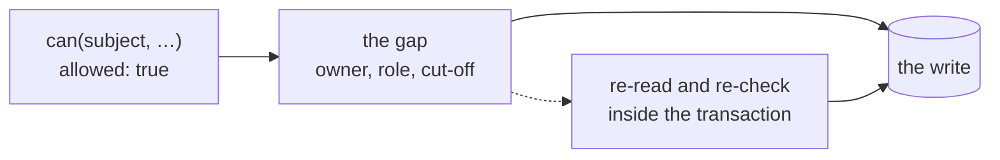

# Caveats and pitfalls

Each heading names a mistake the `@evanion/acl` API invites, and the text
under it says what to write instead.

## Reading a decision

Every decision `@evanion/acl` returns carries one gate, `allowed`, and several
explanation fields that gate nothing.

### Gate on `allowed`, not on `reason`

The fence builds its evaluator with `parseMatrix`, which reads a matrix another
service published, as
[How do I use rules another service published?](../adopting) teaches.
`maxStale` on that matrix is how many milliseconds after `fetchedAt` a holder
may keep deciding on it. Each `can` call in the fence refuses for a different
reason:

```ts twoslash file=libs/acl/README.md region=gate-on-allowed

```

`reason` has seven values. `allow` grants, and `denied` means a deny rule
matched. The other five refuse without any deny rule matching, so a gate written
as `reason !== 'denied'` lets all five through:

- `no-rule-matched`: no allow rule matched
- `unknown-action`: the matrix carries no such permission
- `unevaluable`: the call lacked a field a rule reads
- `unusable-clock`: the instant passed to `can` did not parse
- `stale-contract`: the matrix is older than its `maxStale` allows

### `unevaluable` is not `denied`

`unevaluable` means the evaluator could not reach the decision with the data it
was handed, and `missing` names what to fetch. One refetch turns it into an
answer:

```ts twoslash file=libs/acl/README.md region=refetch

```

- `allowed` is already `false`, so a server that refuses on it is safe.
- A UI that renders the control read-only because `first.allowed` is `false`
  hides something the user can have.
- Render the control as pending, fetch what `missing` names, and ask once more.
- A caller who reads `unevaluable` as permission has a hole.

An `unevaluable` that survives a refetch is a mistyped field name in the
document. A `schema`, the optional list of fields each object kind carries,
turns that mistake into an `UnknownFieldError` when the evaluator is built.
[Why was this refused?](../refusals#when-the-answer-is-unevaluable) covers the
refetch and the schema.

### A key the document does not carry is absent, not false

`menu` below is the navigation the app is about to draw, each entry carrying
the permission key it needs.

```ts twoslash file=libs/acl/README.md region=capabilities-menu

```

`access.capabilities(subject)` returns a capability map, taught on
[What may this user do at all?](../listing-permissions), with an entry per
permission in the document.

- A key the document does not carry reads `undefined`, and
  `undefined !== false` is `true`.
- A menu filtered with `!== false` grows an item whenever somebody renames a
  permission.

## Writing fields with `canFields`

`@evanion/acl`'s `canFields` answers per field, and
[Which fields may they write?](../writing) teaches its arguments. Each heading
below names one way of misreading that answer.

### Never hand-filter the field map

```ts twoslash file=libs/acl/README.md region=hand-filter

```

`canFields` decides each field as one of three `FieldState` values: `allowed`,
`denied` or `unevaluable`. `transitions` lists the values a field may move to
from its current value, and when the row lacks that value, `canFields` decides
the field `unevaluable`.
A filter that drops only the `denied` keys writes a value the decision declined
to approve, in two ways:

- a key that decided `unevaluable`, since `'unevaluable' !== 'denied'` is `true`
- a key the decision does not carry at all, since `undefined !== 'denied'` is
  `true`

`pickAllowedFields` keeps the keys that decided `allowed` and withholds the
rest.

### A name absent from `fields` is not a denial

```ts twoslash file=libs/acl/README.md region=projection-fields

```

`canFields` keys the map by the union of four sets:

- the object's own keys
- the proposed write's keys
- the rule's field names
- the names in the permission's `fields` list

Hand `canFields` a row the query selected only some fields of, and the map
shrinks. A name in the map is a
decision; a name missing from it is a question nobody asked. A form rendered
from `fields` draws fewer inputs, and `pickAllowedFields` writes only keys that
decided `allowed`, so the default direction is the safe one.

### Read `allowed`, not `action.allowed`

```ts twoslash file=libs/acl/README.md region=field-decision

```

`canFields` returns two booleans named `allowed`, one nested inside the other,
and they disagree whenever the action is allowed and some field is not.

- `fd.allowed` composes both: the action is allowed and every decided field is
  allowed.
- `fd.action.allowed` is the action alone.

### Do not iterate `fields` without checking `allowed` first

`canFields` fills the field maps whatever the action decides.

- A subject refused the action still gets a complete map of which fields would
  be editable once the action is unblocked.
- A caller who reads that map as the gate skips the action entirely.
- The map looks identical either way.

### A `targets` or `transitions` config is not an allow-list

```ts twoslash file=libs/acl/README.md region=config-not-allow-list

```

`targets` lists the values a field may be set to, and `transitions` lists the
moves from its current value. Either config restricts the field it names and no
other.

- With no `fields` list, every unnamed key is writable.
- A caller who reads the config as the writable-field list leaves the rest of
  the row open.

## Authoring a policy

Two `@evanion/acl` mistakes live in the policy itself, where no call site can
catch them.

### A condition may only read fields the subject cannot write

```ts twoslash file=libs/acl/README.md region=self-authorizing

```

If the subject can write `sharedWith`, they authorize themselves for the
wishlist. The evaluator cannot see this: it does not know which object fields
the subject can write, and the write that opens the door is a different action
from the read. Let no action the subject holds write the field a read rule keys
on, or key the rule on something out of reach: ownership set at creation, or a
field only the server writes.

### The matrix is public in its names, not only its values

`refund-without-receipt` as an action name, or `shrinkage-auditor` as a role
string, is disclosed the moment a page loads. The document reaches the client in full,
carrying:

- every object kind and every action
- every role
- every field name, including the ones the API never returns
- every instant a `p.before` or `p.after` condition compares against

The browser needs the whole document to answer. Name things as if a reader has
them open, and keep secrets and server-only predicates out of the document.

## Around the `can` call

Three `@evanion/acl` mistakes sit in the code around `can`: where the subject
comes from, which process decides, and when the write runs.

### The subject is whatever you hand it

`can(subject, …)` authorizes the bag it receives and has no channel to ask where
that bag came from. A subject derived from any of these gets the attacker's
claimed identity faithfully authorized:

- a header
- a query parameter
- an unverified token body
- a field the client posted

No evaluator can fix a forged subject. Resolve the subject from a verified
session or token, server-side, before it reaches the call.

### A browser decision enforces nothing, and every layer decides for itself

In a browser, your code reads `can` to decide what the user sees. The control
disappears; the data behind it stays, and so does the request it would have
sent. The call has the same signature and return type on a server, so nothing
in the types marks an answer as authoritative. The process it runs in does: a
server's answer guards the write, and a browser's answer only draws the screen.

A gateway, or any other server in front of the service, that already allowed the
request does not excuse the service behind it, because a caller reaches that service directly
whenever it wants to. The second evaluation is a local function call over a
frozen object, which makes "check again" a rule a team can keep.

### Re-check inside the transaction

A decision describes the snapshot it was given. Between `can` returning `true`
and the write landing:

- the object can change owner
- the subject can lose the role
- a `p.before` cut-off can pass

A decision carries no record of when its inputs were read, so `can` cannot see
the gap.



Re-read the object and re-check inside the transaction, or write with a
conditional predicate that fails when the state has moved.

## Two gaps `@evanion/acl` leaves to the caller

`@evanion/acl` trusts the clock and the objects a caller passes, and a caller
who knows about these two gaps avoids both.

### A clock the caller supplies is the clock the windows move with

```ts twoslash file=libs/acl/README.md region=clock

```

`now` is the instant every `p.before` and `p.after` condition compares against,
so it decides which time windows are open. The evaluator has no channel to ask
where the instant came from. Pass `now` only to make a server render and the
client's first render agree, and resolve it server-side. A `now` from a request
body lets the caller open every time window in the matrix.

`crossed.now` went through JSON, so the `Date` arrives as an ISO string, and
`can` reads the string as the same instant.

The one guarded case is a clock that does not parse. Each of these answers
`{ allowed: false, reason: 'unusable-clock' }` whether the time condition sits
in an allow rule or a deny rule, so a time-gated deny goes on denying:

- `null`
- `NaN`
- an `Invalid Date`
- a string that is not a date

### The subject and object bags are read live

```ts twoslash file=libs/acl/README.md region=live-bag

```

Conditions read `subject` and `object` field by field as the decision walks the
rules, and the evaluator reads the deny side before the allow side. A bag whose
properties are accessors can answer the two sides differently and pass the deny
it should have matched:

- an ORM row
- a lazy proxy
- a memoised getter over a cache that can refill

The evaluator copies neither the subject nor the object, because they are the
app's data. The matrix it evaluates is a frozen deep copy, so nothing can change
it between two reads. Pass plain, already-resolved objects.

## The attack classes behind these pitfalls

`@evanion/acl` holds itself to [a list of attack classes](../attacks), one row
per class, each naming the test that proves it under `nx test @evanion/acl`. The
[security contract](../security) covers the same material in prose.
