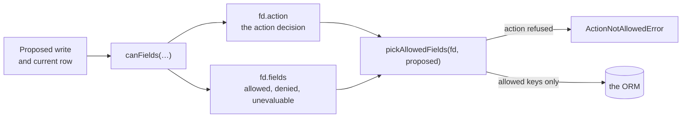

# Which fields may they write?

`canFields` decides an action and every field of a proposed write in one call. A write isn't all-or-nothing: you might allow a customer to edit the body of their question, but not its `status`.

<PageSheet
  difficulty={4}
  read={8}
  hands={20}
  requires={[['Rules about the thing being accessed', '../object-rules']]}
  unlocks={[
    ['Why was this refused?', '../refusals'],
    ['Field permissions', '../fields'],
  ]}
/>

## Securing field-level writes

If you handle partial writes by manually stripping fields in your backend handler, you're duplicating your `@evanion/acl` rules. If a new field such as `pinned` is added to the database, you must remember to add it to every "strip list" in your code, or you risk allowing users to overwrite sensitive data, a vulnerability known as mass-assignment.

Use `canFields` in place of a hand-written filter over the data a form sends. It decides whether the action is allowed and which specific fields of the proposed write are permitted. A customer edits the body of a question they asked on Baize's listing for the board game Wingspan, and the form posts `status` beside the body:

```ts twoslash file=libs/acl/README.md region=write-path

```

Here is how the process works:

1. **`canFields(subject, kind, action, row, axis, proposed)`**: You pass the current object from the database and the proposed write from the user. The fifth argument is the axis: `'write'` decides a proposed write, and `'read'` decides which fields of a fetched row the subject may see. The function returns a field decision (`fd`).
2. **The Decision**: `fd.action` tells you if the overall action is allowed, in the same shape `can` returns. `fd.fields` gives every field a state (`allowed`, `denied`, or `unevaluable`). Here `.fields(['*', '!status'])` makes `status` decide `denied`.
3. **`pickAllowedFields(fd, proposed)`**: This helper takes the decision and the proposed write, and returns a new object containing _only_ the fields that were explicitly allowed.

By passing the result of `pickAllowedFields` directly to your ORM, you ensure that no unapproved fields ever reach your database.



## Defining field rules

`@evanion/acl`'s `.fields()` method sets the field permissions of the action declared most recently in the chain.

There are four ways to define these rules:

| Strategy              | Syntax                                         | Result                                               |
| --------------------- | ---------------------------------------------- | ---------------------------------------------------- |
| **Baseline and Cuts** | `.fields(['*', '!status'])`                    | Allow everything except `status`                     |
| **Allow-list**        | `.fields(['body'])`                            | Allow only `body`; deny everything else              |
| **Custom Config**     | `.fields({ fields: ['body'], status: {...} })` | Allow the listed names, and apply a config per field |
| **Open**              | (no `.fields()` call)                          | Allow all fields provided in the write               |

`*` is the baseline and `!name` subtracts from it; neither is ever a field name. A list of plain names, the allow-list row above, is the name list: it allows what it names and nothing else. Building the evaluator, with `.build()` or from JSON, throws when these are mixed up:

- A `!name` with no `*` raises `DenyWithoutBaselineError`.
- A `!name` inside a list of names raises `BangInAllowListError`, because that list already denies everything it does not name.

### Advanced Field Constraints

An `@evanion/acl` per-field config restricts the values one field may take:

- **`targets`**: An allow-list of acceptable values. For example, `status: { targets: ['open', 'locked'] }` ensures the status can only be set to one of those two values.
- **`transitions`**: A state machine that controls how a value can change. You define the current value as a key and an array of allowed next values. An empty array indicates a terminal state that can never be changed.

A field given both raises `TargetsTransitionsConflictError`.

```ts twoslash file=libs/acl/README.md region=field-configs

```

`fd.reasons` gives each field's reason beside its state, one of the `FieldReason` strings [Why was this refused?](../refusals#explaining-one-field-of-an-acl-field-decision) tables:

- `closing` takes `status` along the one edge, `open` to `locked`.
- `reopening` starts from `locked`, whose empty array refuses every edge, with `transition-failed`.
- `unread` passes a row loaded without `status`, so the config has no edge to read and `status` decides `unevaluable`, with `missing-field`.
- `pinning` posts `pinned`, a key no question row has, and it still gets a state: the name list refuses it as `not-listed`, which is how a mass-assignment attempt ends.

A per-field config decides its own field on the write axis, and the name list never sees that field. So `fields: ['*', '!status']` beside a `status` config leaves `status` to the config, and the `!status` takes nothing back. A config restricts only the field it names: with no name list beside it, every other key stays writable, as [Caveats and pitfalls](../pitfalls) shows.

## Handling the "Unevaluable" field

Just as with object-level rules, `@evanion/acl` field-level rules can be `unevaluable`. This happens if a field rule depends on a value that wasn't fetched from the database.

For example, if a transition rule needs to know the current `status` to decide if a write is allowed, but the `status` field is missing from the row, the field decision is `unevaluable`. A filter that drops only the `denied` keys writes it anyway:

```ts twoslash file=libs/acl/README.md region=hand-filter

```

`'unevaluable' !== 'denied'` is `true`, so `narrowed` carries `status: 'open'` onto a question the database may hold as `locked`. The filter also writes any key the decision carries no entry for, because `undefined !== 'denied'`.

A crucial distinction: `pickAllowedFields` treats `unevaluable` fields the same as `denied` fields, and withholds them from the write. This ensures that if you can't prove a write is allowed, it is not performed.

## When the acl action itself is refused

`canFields` returns two booleans named `allowed`, one nested inside the other, and they can disagree. `fd.allowed` is `true` only when the action is allowed and every field is allowed. `fd.action.allowed` reports the action on its own.

`pickAllowedFields` throws `ActionNotAllowedError` when the action is refused, because no field of a refused action is writable. Where the action is allowed and the field rules deny some keys, it returns the allowed subset.

<Panel heading="`fd.fields` is filled even when the action is refused">
  <Text as="div" size="sm">
    Every field carries a state whatever `fd.action.allowed` says, so a blocked
    handler still learns which fields become editable once the action is
    allowed. A loop over `fd.fields` that never reads `fd.allowed` writes the
    fields of an action the engine refused. Read `fd.allowed` first, or call
    `pickAllowedFields`, which reads the action for you.
  </Text>
</Panel>

## Try the acl field axis yourself

The control below runs one `@evanion/acl` `canFields` call and shows both maps beside the object `pickAllowedFields` returns from them. Its policy carries the field rules from the `field-configs` example above, and a second allow rule lets a bookseller update any question. You can sign in as Sam, the customer who asked the question; Jo, another customer; or Mika, a bookseller. It opens signed in as Sam over an open row whose proposed write moves `status` to `locked`. Four moves take it elsewhere:

- Sign in as Jo, who asked no question here. The action decides `no-rule-matched`, and `pickAllowedFields` throws `ActionNotAllowedError`.
- Tick the `pinned` checkbox, which posts a key the name list never mentions. `pinned` decides `denied` with `not-listed`, and the write that reaches the ORM does not carry it.
- Set `status now` to `locked`. The `transitions` config names an empty array of edges out of `locked`, so `status` decides `denied` with `transition-failed`.
- Tick the checkbox saying the query did not select `status`. `status` decides `unevaluable` with `missing-field` and is withheld from the write.

<FieldWriteDemo />

## Explaining refusals and reading fields

`@evanion/acl`'s `canFields` and `pickAllowedFields` now keep a refused field out of your database.

- [Why was this refused?](../refusals) explains how to interpret field-level reasons and provide feedback to users.
- [Field permissions](../fields) covers how to use the `read` axis of `canFields` to implement a projection layer, ensuring users only see the fields they are allowed to see.
