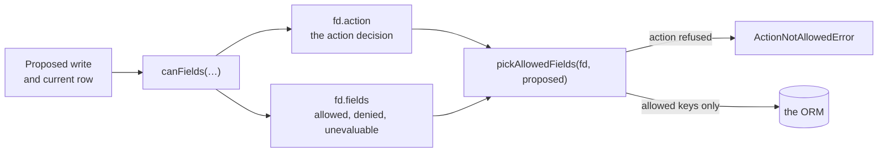

# Which fields may they write?

In a typical application, a "write" operation isn't all-or-nothing. You might allow a user to edit the body of a support ticket, but not its priority or its assigned agent.

If you handle this by manually stripping fields in your backend handler, you're essentially duplicating your authorization rules. If a new field is added to the database, you must remember to add it to every "strip list" in your code, or you risk allowing users to overwrite sensitive data—a vulnerability known as mass-assignment.

`@evanion/acl` solves this by extending the authorization model to individual fields.

<PageSheet
  difficulty={4}
  read={8}
  hands={20}
  requires={[['Rules about the thing being accessed', '../object-rules']]}
  unlocks={[
    ['Why was this refused?', '../refusals'],
    ['Field permissions', '../fields'],
  ]}
/>

## Securing field-level writes

Instead of manually filtering the data sent by a form, you can use `canFields`. This function decides if an action is allowed and, if so, which specific fields of the proposed write are permitted.

```ts twoslash file=libs/acl/docs/examples.md region=write-path

```

Here is how the process works:

1. **`canFields(...)`**: You pass the current object from the database and the proposed write from the user. The function returns a field decision (`fd`).
2. **The Decision**: `fd.action` tells you if the overall action is allowed. `fd.fields` tells you the state of every field in the write (allowed, denied, or unevaluable).
3. **`pickAllowedFields(fd, proposed)`**: This helper takes the decision and the proposed write, and returns a new object containing _only_ the fields that were explicitly allowed.

By passing the result of `pickAllowedFields` directly to your ORM, you ensure that no unapproved fields ever reach your database.



## Defining field rules

You can control field permissions using the `.fields()` method. This method targets the action declared immediately before it in the chain.

There are four ways to define these rules:

| Strategy              | Syntax                                         | Result                                             |
| --------------------- | ---------------------------------------------- | -------------------------------------------------- |
| **Baseline and Cuts** | `.fields(['*', '!status'])`                    | Allow everything except `status`                   |
| **Allow-list**        | `.fields(['body'])`                            | Allow only `body`; deny everything else            |
| **Custom Config**     | `.fields({ fields: ['body'], status: {...} })` | Allow specific fields and apply a config to others |
| **Open**              | (no `.fields()` call)                          | Allow all fields provided in the write             |

### Advanced Field Constraints

For maximum control, you can provide a configuration object for specific fields. This allows you to enforce value-based rules:

- **`targets`**: An allow-list of acceptable values. For example, `status: { targets: ['open', 'locked'] }` ensures the status can only be set to one of those two values.
- **`transitions`**: A state machine that controls how a value can change. You define the current value as a key and an array of allowed next values. An empty array indicates a terminal state that can never be changed.

```ts twoslash file=libs/acl/docs/examples.md region=field-configs

```

## Handling the "Unevaluable" field

Just as with object-level rules, field-level rules can be `unevaluable`. This happens if a field rule depends on a value that wasn't fetched from the database.

For example, if a transition rule needs to know the current `status` to decide if a write is allowed, but the `status` field is missing from the row, the field decision is `unevaluable`.

A crucial distinction: `pickAllowedFields` treats `unevaluable` fields the same as `denied` fields—it withholds them from the write. This ensures that if you can't prove a write is allowed, it is not performed.

## Next steps: Field permissions and refusals

You now know how to protect your database from mass-assignment.

- [Why was this refused?](../refusals) explains how to interpret field-level errors and provide feedback to users.
- [Field permissions](../fields) covers how to use the `read` axis of `canFields` to implement a projection layer, ensuring users only see the fields they are allowed to see.
