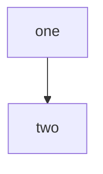

# Diagrams on the documentation site

Status: accepted
Depends on: `2026-09-12-baize-ui.md` (the tokens a diagram is coloured from),
`2026-09-13-interactive-examples.md` (the standard this extends, and the
verification bar it sets)

## Why

A concept is taught by three things: prose, a diagram, and a code block. This
repo has machinery for the third — region fences pulled from a README that
doctest runs, probes that call the real function on a keystroke — and had
nothing for the second. A flow, a decision procedure or a dependency graph was
carried entirely in sentences, and a reader had to assemble the shape from them.

## What an author writes

A fenced block. Nothing else.

````md

````

The fence is the interface rather than a component, because a fence is portable:
it renders on GitHub, in an editor preview, and in whatever reads the file next,
and it stays a code block to every tool that has never heard of this site.

`caption` is required. `tools/repo-checks/src/diagram-captions.test.ts` fails
naming the page without one. It is the claim the figure makes, the accessible
description for a reader who cannot see it, and — because the diagram is drawn in
the browser — the only part of it that reaches the static HTML, so it is what
search indexes and what a reader with no JavaScript gets.

`:::accent` marks one node as the thing the figure is about. It is the only
saturated colour a diagram spends; see below.

## What it is not verified by

**A diagram is text, so it is diffable and reviewable in a way a hand-drawn PNG
is not. It is not verified.** Nothing fails when a diagram describes a flow the
code no longer has. A `file=… region=…` fence is checked — the region has to
exist, and the values in it were produced by a test run. A diagram is checked for
none of that. Its caption is checked to exist; its claim is checked by nobody.

So a diagram is never the sole carrier of a fact. Whatever it shows is also in
the prose or a table on the same page, and the diagram is there because it shows
the shape more economically, not because it is the only place the shape is
written down. A reader with no JavaScript, and the search index, both depend on
that being true.

A mechanism that would close this is reachable and is not built: a diagram whose
node ids are symbol names, checked against the exported surface the way
`tools/repo-checks` already checks region names. It would cover dependency graphs
and nothing else, which is why it is named here as a possibility rather than
shipped.

## Which tool for which picture

- **Mermaid**, for flows, decision procedures and topologies. What this document
  settles.
- **Twoslash**, for anything that is a TypeScript type. Nextra 4.6.1 supports it
  natively, and `^?` emits the compiler's own inferred type into the page, so the
  annotation cannot go stale. A hand-drawn type annotation is the rot above with
  a fix available.
- **Box-drawing characters in an ordinary fence**, for structure that is not
  TypeScript — a wire format, a URN's parts, a directory layout. No build step,
  copies as text, theme-agnostic by construction.

A diagram that lives outside the repo is worse than a stale fence inside it: it
cannot be diffed, reviewed or grepped, and it adds a network dependency to
reading a page.

## Why Mermaid, and why the browser draws it

Nextra 4.6.1 runs `@theguild/remark-mermaid` over a ```mermaid fence
unconditionally and `mermaid@11` is already in the tree, so the fence rendered
before any of this was written. Everything else — D2, Graphviz, nomnoml, svgbob —
has to beat "already works" by enough to justify a second toolchain, and none of
them does for the shapes this repo draws. Mermaid's syntax is also the one an
agent writes fluently without looking anything up, which matters here, where
agents author most of the content.

Rendering at build time was the real alternative, and it fails on one concrete
thing: Mermaid lays out by measuring rendered text. Under jsdom it returns an SVG
whose nodes have collapsed onto each other, because `getBBox` is not implemented;
correct layout in Node needs headless Chromium, which is what `mermaid-cli` ships
and what every contributor's install and every CI run would then pay for. That
cost is larger than the one it saves.

The bundle cost it saves turns out to be small. Mermaid is about 500 kB of
JavaScript, and none of it is in a shared chunk: `Diagram.tsx` imports it
dynamically, from inside an `IntersectionObserver` callback, so a page with no
fence never fetches it and a page with one fetches it when the diagram is about
to be read.

## The colours

A diagram is coloured from the Baize tokens and carries none of Mermaid's own
palette. Mermaid makes that awkward in a specific way: it bakes literal hex
values into a `<style>` block inside the SVG, and its `themeVariables` cannot be
handed `var(--baize-felt)`, because khroma parses every variable to derive the
ones that were not supplied and throws on anything that is not a colour.

So the render is given six sentinel colours and the returned SVG string has each
one replaced by the custom property it stands for. What reaches the page is a
diagram whose every colour is a `var(--baize-*)`, which buys two things:

- **The theme toggle is free.** Light and dark rebind the properties, the same
  way they rebind them for a paragraph. Nothing re-renders. Nextra's own Mermaid
  component picks a Mermaid theme from the class on `<html>` and re-runs the
  whole layout on every toggle.
- **Mermaid's palette cannot appear.** `apps/docs/components/diagram/diagram.test.ts`
  renders every fence on the site and fails on any colour left over that is
  neither a sentinel nor inert.

### The section hue: taken, as one mark

A page under `content/acl/` carries coral through `--baize-hue`, and a diagram on
it could pick that up. It does, on exactly one element: the node an author marked
`:::accent`.

Outlining every node in the section's colour was the other option and is noise.
It says what the page title already says, and it spends the one saturated channel
a diagram has on identity instead of on meaning. The site's own rule is that a
hue lands on type and hairlines and never as a wash; every node outlined is a
diagram's version of a wash.

Every categorical hue clears 4.5:1 against both grounds — `tokens.test.ts` holds
them to it — so the accent reads in both themes including `stone`, the
unsaturated one. Everything else in a diagram is a ground role: the surface for a
node, the hairline for its border, primary text for a label, secondary for a
line.

## Width

Mermaid is told not to fit the SVG to its container. Fitting means a diagram
wider than a phone is scaled down until its labels are a few pixels tall, which
is a worse failure than a scrollbar. The SVG keeps the width its text needs and
`.docs-diagram__frame` scrolls sideways — the only element on the site that does.
The frame is focusable so that scroll is reachable without a mouse.
